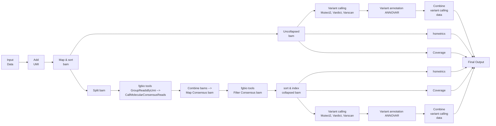

# Capture based assay for MRD detection

## Table of Contents

1. [Introduction](#introduction)
2. [Pipeline summary](#pipeline-summary)
3. [Pipeline structure](#pipeline-structure)
4. [References](#requirements)
5. [Usage](#usage)
6. [Output](#output)
7. [Citation](#citation)
8. [Contact](#contact)

## Introduction
&emsp;This repository describes a Nextflow pipeline for the analysis of error-corrected sequencing data using [fgbio tools](https://github.com/fulcrumgenomics/fgbio). Individual sample libraries incorporate an 8bp Unique molecular index (UMI) tag. These libraries were subjected to target enrichment using a 21-gene panel comprising 192 probes, following the IDT XGen capture protocol.  
&emsp;Sequencing of these libraries generated three reads per sample: the UMI, the forward read and the reverse read. These reads are given as input to the pipeline in the .fastq.gz format. Read1 is assumed to contain a 8 bp UMI. read2 and read3 being the forward and reverse reads of 151 bases each. The downstream processing steps for these sample reads are mentioned in the following section. 

## Pipeline summary


## Pipeline structure
Based on the nfcore pipeline structure, this repository contains:
```
assets/					# Folder containing reference files
bin/					# Folder with scripts called in the pipeline
modules/				# Folder containing individual process descriptions
sequences/				# Input sequences
mrd_capture.nf			# Nextflow file defining the pipeline
nextflow.config			# File describing input parameters and computing resources for individual processes
```

## References 

Execution of this pipeline requires certain reference files. These need to be downloaded and the following parameters need to be modified in the `params` section of the `mrd_capture.config` before executing the workflow:  

- *genome* = Complete path to the human genome fasta file(hg19_all.fasta). Please ensure that the BWA index files (hg19_all.fasta.fai, hg19_all.fasta.amb, hg19_all.fasta.ann, hg19_all.fasta.bwt, hg19_all.fasta.pac, hg19_all.fasta.sa) are also present in the same genome folder. The assets folder currently contains placeholder genome and index files.

- *annovar_db* = Complete path to the humandb database folder for ANNOVAR ( To download additional databases in humandb folder, please refer: https://annovar.openbioinformatics.org/en/latest/user-guide/startup/ ; humandb database used from ANNOVAR version 2020June08)

- *bedfile* = This file needs to be updated based on the probes used for the assay

- *outdir* = Location to write the output folder

- *gen_ref* = Complete path to the gene_fullxref.txt file as downloaded from the [ANNOVAR](https://annovar.openbioinformatics.org/en/latest/user-guide/startup/ "annovar site") site

## Usage
1. Clone the repository using ```git clone git@github.com:patkarlab/LSC_Capture_MRD.git```

2. Enter the directory ```cd LSC_Capture_MRD```

3. Download the reference as mentioned in the Reference section above.

4. Transfer the sample input files `*.fastq.gz` inside the `sequences/` folder.

2. Modify the `samplesheet.csv`. The sample_ids, without the file extension, should be mentioned in samplesheet in the following format - <br>
sample1  
sample2  
sample3  
Please remove any empty lines in the samplesheet before running the pipeline.

3. To launch the pipeline, use the following command
```bash
nextflow -C mrd_capture.config run mrd_capture.nf -entry MRD_PROBE -bg -profile docker -resume
```

## Output
Samplewise output folders are written to the folder name mentioned in the `outdir` param in the config file.  
Individual output folder contains:  
- Samplename_collaps.xlsx : Excel file with annotated variants and the coverage values for the error corrected bam file
- Samplename_cons_sortd.bam : Error corrected bam file (and its index)
- Samplename_collaps_hsmetrics.txt : gatk hsmetrics output for the error corrected bam file
- Samplename_uncollaps.xlsx : Excel file with annotated variants and the coverage values for the uncollapsed bam file
- Samplename_uncollaps.bam : bam file (and its index) before error correction.
- Samplename_uncollaps_hsmetrics.txt : gatk hsmetrics output for the uncollapsed bam file

## Citation
If you use this pipeline in your research, please cite:
```
Leukemic stem cell MRD refines relapse-risk beyond conventional FCM and NGS-based approaches in intensively treated AML. 2026
```

## Contact
[Patkarlab](https://github.com/patkarlab)