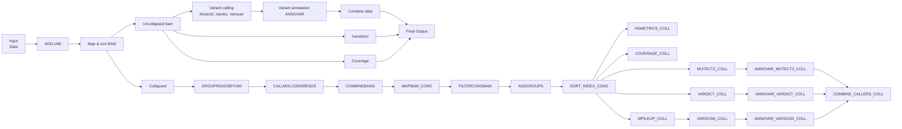

# Capture based assay for MRD detection
## Introduction

&emsp;This repository describes a Nextflow pipeline for the analysis of error-corrected sequencing data using [fgbio tools](https://github.com/fulcrumgenomics/fgbio). Individual sample libraries incorporate an 8bp Unique molecular index (UMI) tag. These libraries were subjected to target enrichment using a 21-gene panel comprising 192 probes, following the IDT XGen capture protocol. 
&emsp;Sequencing of these libraries generated three reads per sample: the UMI, the forward read and the reverse read. These reads are given as input to the pipeline in the .fastq.gz format. Read1 is assumed to contain a 8 bp UMI. read2 and read3 being the forward and reverse reads of 151 bases each. The downstream processing steps for these sample reads are mentioned in the following section. 

## Pipeline summary


## Usage
The following parameters need to be modified in the `params` section of the `mrd_capture.config`: 
- *genome* = Complete path to the human genome fasta file(hg19_all.fasta). Please ensure that the BWA index files (hg19_all.fasta.fai, hg19_all.fasta.amb, hg19_all.fasta.ann, hg19_all.fasta.bwt, hg19_all.fasta.pac, hg19_all.fasta.sa) are also present in the same genome folder. The assets folder currently contains placeholder genome and index files.

- *annovar_db* = Complete path to the humandb database folder for ANNOVAR ( To download additional databases in humandb folder, please refer: https://annovar.openbioinformatics.org/en/latest/user-guide/startup/ ; humandb database used from ANNOVAR version 2020June08)

- *bedfile* = This file needs to be updated based on the probes used for the assay

- *outdir* = Location to write the output folder

- *gen_ref* = Complete path to the cross-reference file for gene-based annotation (Present in the Annovar folder in  example/gene_fullxref.txt)

## Running the pipeline
1. Transfer the sample input files `*.fastq.gz` inside the `sequences/` folder.

2. Modify the `samplesheet.csv`. The sample_ids, without the file extension, should be mentioned in samplesheet in the following format - <br>
sample1  
sample2  
sample3  
Please check for empty lines in the samplesheet before running the pipeline.

3. To execute the pipeline, use the following command
```bash
nextflow -C mrd_capture.config run mrd_capture.nf -entry MRD_PROBE -bg -profile docker -resume
```

## Output
Samplewise output folders are written to `"outdir"` folder.
